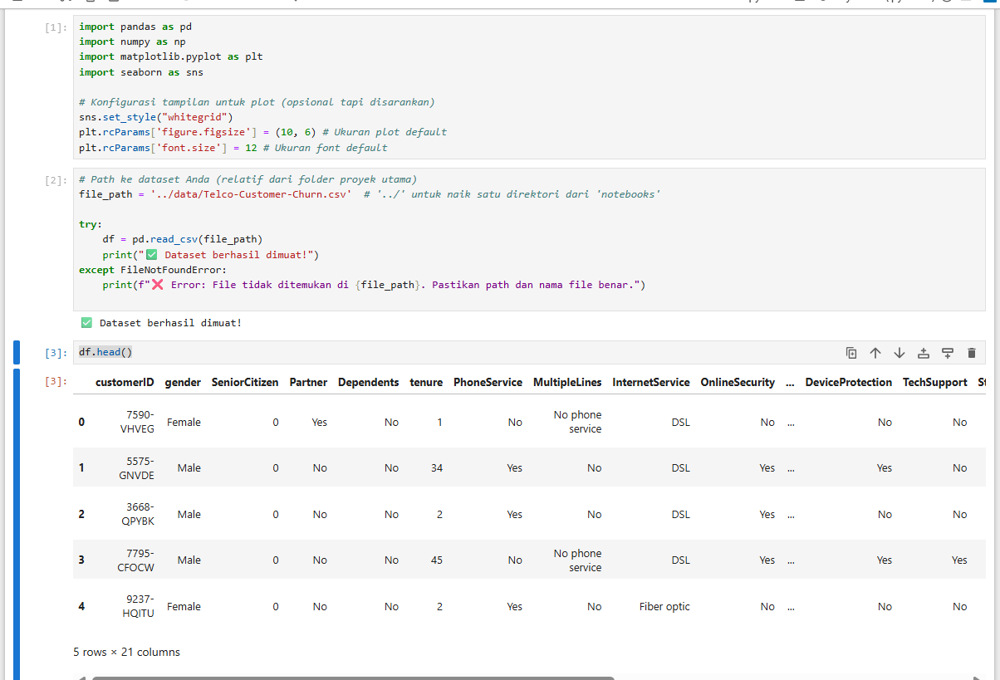
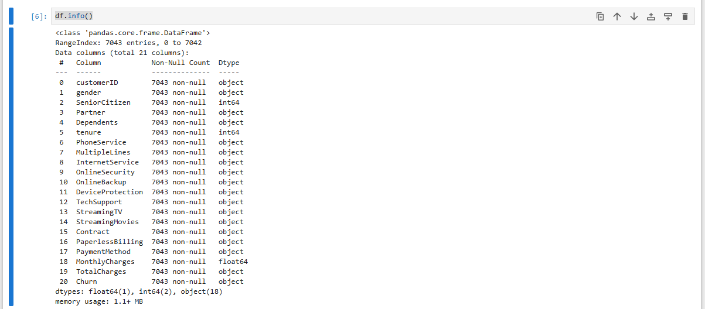
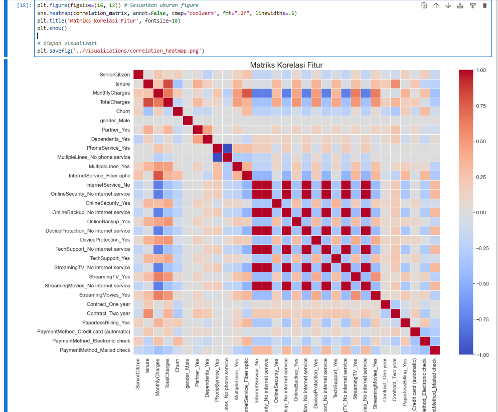

# 📉 Customer Churn Analysis 

Proyek ini bertujuan untuk menganalisis data pelanggan guna mengidentifikasi faktor-faktor utama yang menyebabkan churn (berhentinya pelanggan). Analisis ini mencakup pembersihan data (data cleaning), analisis eksploratif (EDA), dan visualisasi korelasi antar variabel. Hasil dari proyek ini dapat dimanfaatkan untuk menyusun strategi retensi pelanggan yang lebih efektif.

---

## 🎯 Tujuan Proyek
- Mengidentifikasi pola dan karakteristik pelanggan yang berpotensi churn
- Menangani data yang hilang, outlier, serta inkonsistensi dalam dataset
- Melakukan eksplorasi data dan visualisasi korelasi antar variabel
- Memberikan insight awal untuk pengambilan keputusan bisnis terkait retensi pelanggan

---

## 🧰 Teknologi yang Digunakan
- Python
- Pandas & NumPy
- Seaborn & Matplotlib
- Jupyter Notebook

---

### 📋 Tampilan Awal Data (`df.head()`)

---

### ℹ️ Informasi Struktur Data (`df.info()`)

---

### 🔥 Heatmap Korelasi Antar Variabel

---

### 📊 menganalisis hubungan antara variabel numerik (tenure dan MonthlyCharges) dengan churn pelanggan
%20dengan%20churn%20pelanggan.png)

%20dengan%20churn%20pelanggan%20ke%20-2.png)

%20dengan%20churn%20pelanggan%20ke%203.png)

---

> 📁 Semua grafik di atas disimpan di folder `/image/` dalam repositori ini.
